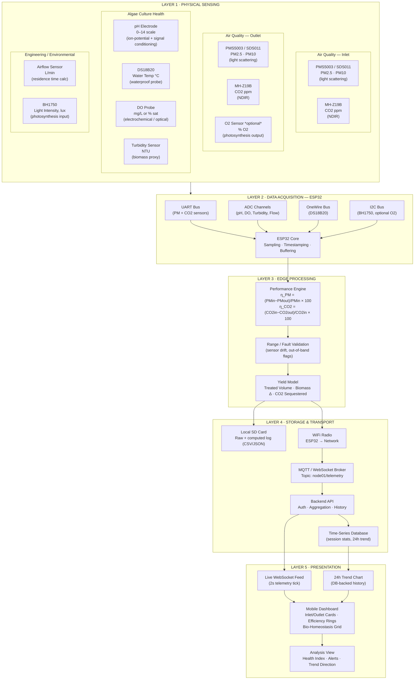

# AeroAlga BDPA-v2 — Telemetry Data Flow Architecture

**From Sensor to Screen: Hardware-to-Software Signal Path**

---

## 1. Overview

This document maps how a physical measurement — light scattered off a particulate, infrared absorbed by CO₂, a millivolt signal off a pH electrode — becomes a number on the operator's dashboard. The path has five layers: **Sensing → Acquisition → Processing → Storage/Transport → Presentation**. Each sensor from the instrumentation spec is placed at its correct interface (UART, I2C, OneWire, or Analog/ADC) rather than treated as a generic "input," since that interface choice is what actually constrains ESP32 firmware design.

---

## 2. Flowchart

---

## 3. Interface Reference Table

| # | Sensor | Signal Type | ESP32 Interface | Layer |
|---|---|---|---|---|
| 1 | PMS5003 / SDS011 (Inlet) | Digital, framed serial | UART | Sensing → Acquisition |
| 2 | PMS5003 / SDS011 (Outlet) | Digital, framed serial | UART | Sensing → Acquisition |
| 3 | MH-Z19B (Inlet) | Digital (UART) or PWM | UART | Sensing → Acquisition |
| 4 | MH-Z19B (Outlet) | Digital (UART) or PWM | UART | Sensing → Acquisition |
| 5 | O2 Sensor *(optional)* | Digital / I2C, board-dependent | I2C or UART | Sensing → Acquisition |
| 6 | pH Electrode | Analog millivolt | ADC (with signal-conditioning circuit) | Sensing → Acquisition |
| 7 | DS18B20 | Digital, 1-wire | OneWire | Sensing → Acquisition |
| 8 | DO Probe | Analog or digital, sensor-dependent | ADC / UART | Sensing → Acquisition |
| 9 | Turbidity Sensor | Analog voltage | ADC | Sensing → Acquisition |
| 10 | Airflow Sensor / Flow Meter | Analog or pulse output | ADC / Pulse counter (GPIO interrupt) | Sensing → Acquisition |
| 11 | BH1750 Light Sensor | Digital | I2C | Sensing → Acquisition |

---

## 4. Layer Notes

- **Layer 1 — Physical Sensing.** Inlet and outlet PM/CO2 pairs are kept as separate subgraphs deliberately: the efficiency formulas only mean something if the two readings are unambiguously tied to a position (before/after the reactor), not just "two sensors of the same type."
- **Layer 2 — Acquisition.** Grouping by bus (UART / ADC / OneWire / I2C) rather than by sensor name reflects how ESP32 firmware is actually structured — shared bus sensors (BH1750 + optional O2 on I2C) need address arbitration; UART sensors need multiplexing or multiple hardware UARTs.
- **Layer 3 — Edge Processing.** Runs on-device before anything leaves the node. This is where η_PM and η_CO2 are computed from raw inlet/outlet values, and where out-of-range validation catches a failed or drifted sensor before it corrupts a yield calculation downstream.
- **Layer 4 — Storage & Transport.** SD logging is the resilience path (works with no network); the WiFi → MQTT/WebSocket → API path is what feeds a live dashboard. Both branch off the same validated data, not off raw sensor output.
- **Layer 5 — Presentation.** Two consumption modes: the live 2-second feed for real-time cards, and the database-backed history for 24-hour trend and session statistics — this is the same distinction flagged earlier about not conflating live jitter with slow biological trend data.

---

*Prepared for AeroAlga BDPA-v2 — Node-01 instrumentation review.*
