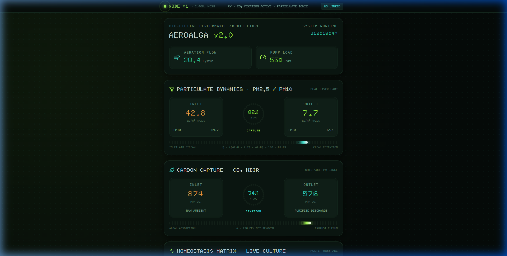
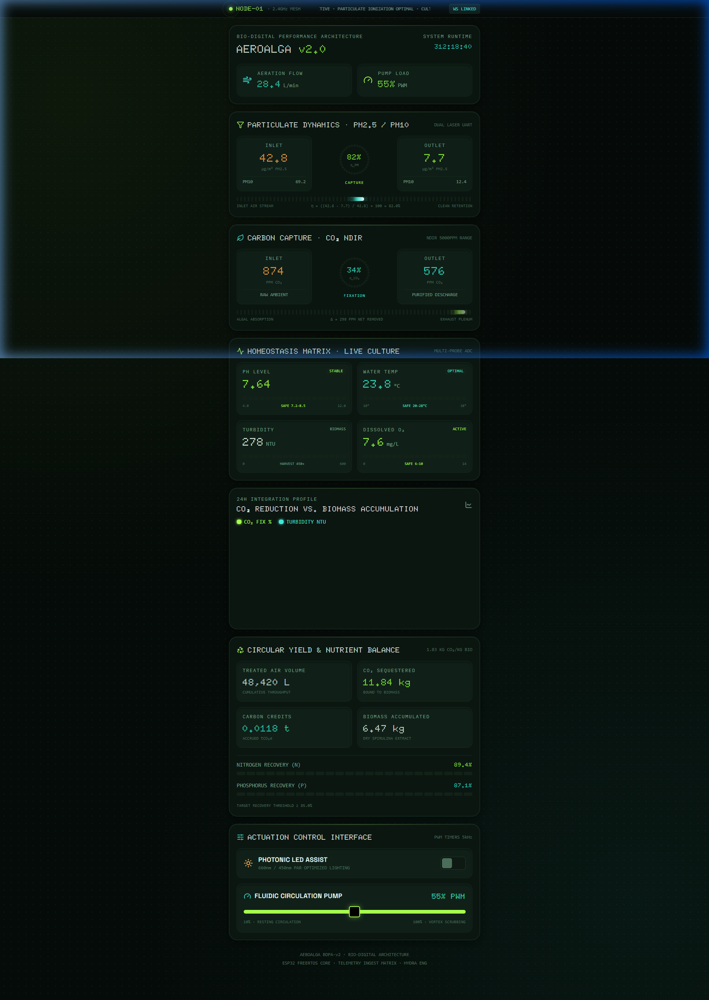
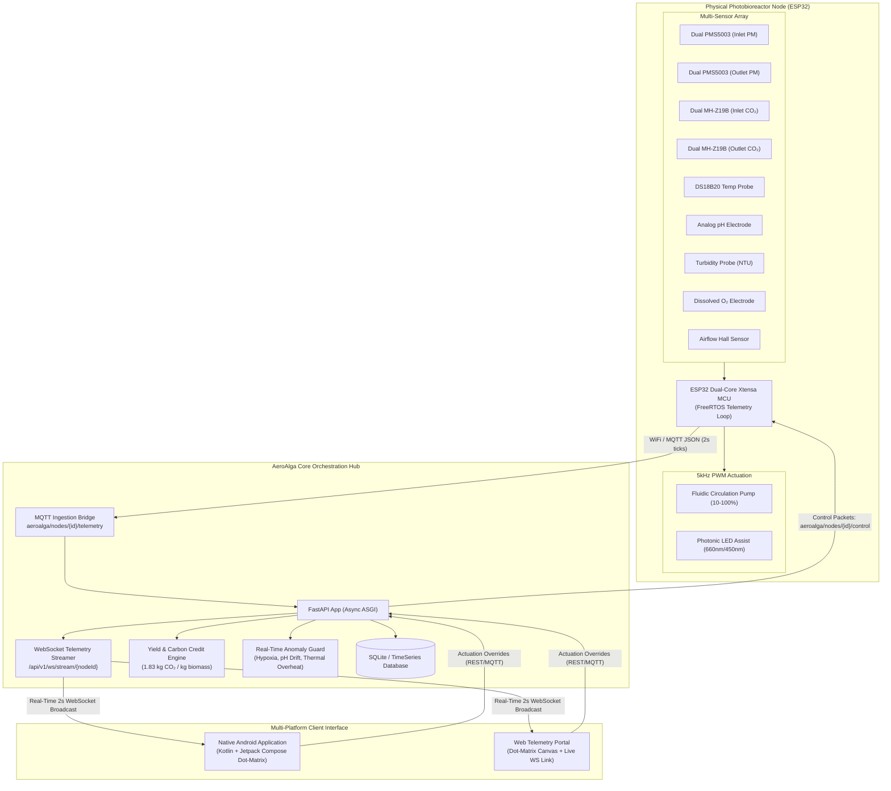
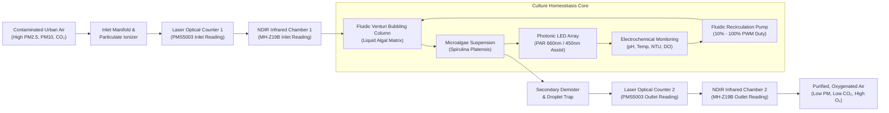
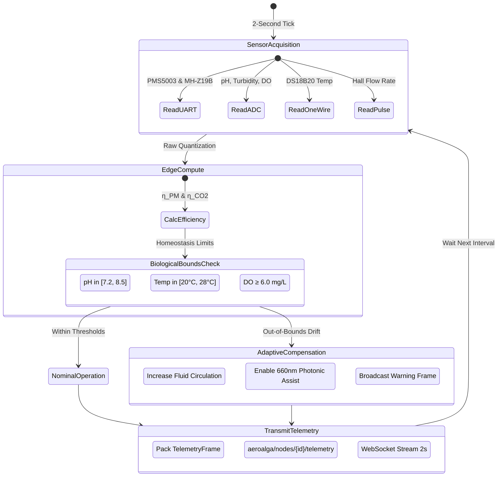
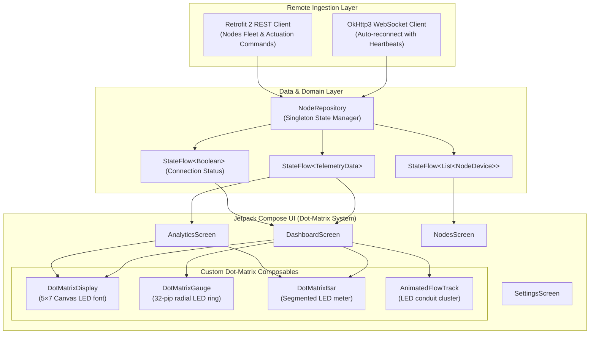

<div align="center">

# 🌿 AeroAlga BDPA-v2
### Bio-Digital Photobioreactor Architecture & Urban Carbon Fixation System
**Real-Time Autonomous Air Purification · Microalgal Gaseous Exchange · Dot Matrix UI · Edge Telemetry**

[](https://github.com/hydra-eng/aero-alga/actions/workflows/android_ci.yml)
[](https://github.com/hydra-eng/aero-alga/actions/workflows/backend_ci.yml)
[](https://www.espressif.com/)
[](https://developer.android.com/jetpack/compose)
[](https://fastapi.tiangolo.com/)
[](LICENSE)

<br/>



</div>

---

## 📖 Executive Summary

**AeroAlga BDPA-v2** is a cybernetic bioreactive air purification and carbon sequestration appliance engineered for high-density metropolitan spaces. By coupling fluidic venturi scrubbing columns with dense cultures of microalgae (*Spirulina platensis* / *Chlorella vulgaris*), AeroAlga continuously extracts particulate matter ($\text{PM}_{2.5}$ / $\text{PM}_{10}$) and converts ambient carbon dioxide ($\text{CO}_2$) into oxygen and biomass via photosynthetic fixation.

The system integrates an **ESP32 FreeRTOS edge firmware node**, a high-throughput **FastAPI / WebSocket orchestration backend**, an authentic **Dot-Matrix Web Telemetry Portal**, and a native **Kotlin Jetpack Compose Android application**.

---

## 🖥️ User Interface: Authentic Dot-Matrix Design

The system introduces an industrial, high-tech **Dot-Matrix UI** (inspired by retro-futuristic laboratory instrumentation, Teenage Engineering, and modern dot-matrix hardware):
- **5×7 LED Typography**: Digits and operational metrics are rendered through discrete phosphor LED dots with bloom glow halos (`#A6FF4D` lime, `#3FE8D4` cyan, `#FFB454` amber) on unlit recessed chassis apertures (`#132219`).
- **32-Pip Discrete Radial Gauges**: Sequential circular LED pips dynamically display particulate filtration ($\eta_{\text{PM}}$) and carbon fixation ($\eta_{\text{CO}_2}$) efficiencies.
- **Segmented LED Homeostasis Bars**: Color-coded discrete LED bargraphs indicate pH, water temperature, biomass turbidity (NTU), and dissolved oxygen with safe-zone highlighting.
- **Hardware Marquee Ticker**: Real-time scrolling LED status banner displaying live node mesh status and telemetry ingestion.

<div align="center">



</div>

---

## 📐 System Architecture & Flowcharts

### 1. End-to-End System Topology



---

### 2. Closed-Loop Biological Filtration & Gas Exchange Flowchart



---

### 3. Edge Signal Processing & Closed-Loop Actuation Logic



---

### 4. Mathematical Modeling & Carbon Credit Formulation

$$\eta_{\text{PM}} = \left( \frac{\text{PM}_{2.5}^{\text{in}} - \text{PM}_{2.5}^{\text{out}}}{\text{PM}_{2.5}^{\text{in}}} \right) \times 100\%$$

$$\eta_{\text{CO}_2} = \left( \frac{\text{CO}_2^{\text{in}} - \text{CO}_2^{\text{out}}}{\text{CO}_2^{\text{in}}} \right) \times 100\%$$

$$\Delta V = Q(t) \cdot \Delta t \quad \left[ \text{Treated Air Volume in Liters} \right]$$

$$\Delta M_{\text{biomass}} = \left( \frac{\Delta \text{CO}_2 \cdot Q(t)}{V_m} \right) \cdot \mu_{\text{bio}} \cdot \Delta t$$

$$\text{CO}_2\text{ Sequestered (kg)} = M_{\text{biomass}}\text{ (kg)} \times 1.83\,\frac{\text{kg CO}_2}{\text{kg dry algae}}$$

$$\text{Carbon Credits Accrued } (t\text{CO}_2\text{e}) = \frac{\text{CO}_2\text{ Sequestered (kg)}}{1000}$$

---

### 5. Android Reactive State Flow & Architecture



---

## ⚡ ESP32 Hardware Pin Allocation & Schematics

| Peripheral | Sensor / Signal | ESP32 GPIO | Protocol / Mode | Voltage Level | Notes |
|---|---|---|---|---|---|
| **Inlet PM** | PMS5003 RX | `GPIO 17` | UART 1 TX | 3.3V Logic | Connects to PMS Pin 5 |
| **Inlet PM** | PMS5003 TX | `GPIO 16` | UART 1 RX | 3.3V Logic | Connects to PMS Pin 4 |
| **Outlet PM** | PMS5003 RX | `GPIO 26` | SoftSerial TX | 3.3V Logic | Downstream scrubbed air |
| **Outlet PM** | PMS5003 TX | `GPIO 25` | SoftSerial RX | 3.3V Logic | Downstream scrubbed air |
| **Inlet CO₂** | MH-Z19B TX | `GPIO 32` | UART 2 RX | 3.3V Logic | Ambient reference concentration |
| **Inlet CO₂** | MH-Z19B RX | `GPIO 33` | UART 2 TX | 3.3V Logic | Command byte polling (9600 baud) |
| **Outlet CO₂** | MH-Z19B TX | `GPIO 18` | SoftSerial RX | 3.3V Logic | Post-fixation stream |
| **Outlet CO₂** | MH-Z19B RX | `GPIO 19` | SoftSerial TX | 3.3V Logic | Post-fixation stream |
| **Water Temp**| DS18B20 Data | `GPIO 4` | OneWire | 3.3V | Requires 4.7kΩ pull-up |
| **Culture pH** | Analog Electrode | `GPIO 34` | ADC1_CH6 | 0 – 3.3V | High-impedance JFET buffer |
| **Turbidity** | Optical NTU Probe | `GPIO 35` | ADC1_CH7 | 0 – 3.3V | Biomass concentration proxy |
| **Dissolved O₂**| Galvanic DO Probe| `GPIO 36` | ADC1_CH0 | 0 – 3.3V | Oxygen saturation monitoring |
| **Airflow Rate**| Hall Pulse Counter| `GPIO 27` | Pulse Interrupt | 3.3V (divided) | Frequency conversion: 7.5 Hz = 1 LPM |
| **Circulation**| Fluidic Pump Gate | `GPIO 14` | LEDC PWM (CH0) | 3.3V PWM (5kHz)| 10% (idle) to 100% (max scrub) |
| **Photonic Assist**| LED Driver Gate | `GPIO 13` | LEDC PWM (CH1) | 3.3V PWM (5kHz)| PAR 660nm / 450nm lighting assist |

---

## 🚀 Quickstart & Deployment

### 1. Backend Orchestration Hub (`backend/`)

```bash
cd backend
python -m venv venv
source venv/bin/activate  # On Windows: .\venv\Scripts\activate
pip install -r requirements.txt

# Run automated tests
pytest

# Start FastAPI server on port 8000
uvicorn app.main:app --host 0.0.0.0 --port 8000 --reload
```

* Swagger API Documentation: `http://localhost:8000/docs`
* Live WebSocket Endpoint: `ws://localhost:8000/api/v1/ws/stream/Node-01`

### 2. Native Android Application (`android/`)

The application is built with modern **Kotlin + Jetpack Compose** and includes its own portable Gradle wrapper.

```bash
cd android

# Build the Debug APK
./gradlew assembleDebug

# Output APK path:
# android/app/build/outputs/apk/debug/app-debug.apk
```

To install directly onto a connected physical Android device or emulator:
```bash
adb install -r app/build/outputs/apk/debug/app-debug.apk
```

### 3. Web Telemetry Portal (`web/`)

The web portal is a single-page standalone application featuring the Dot-Matrix UI. It automatically binds to the live backend WebSocket when hosted or falls back to realistic edge simulation:

```bash
cd web
python -m http.server 8080
# Open http://localhost:8080 in any modern browser
```

### 4. Hardware Firmware (`firmware/`)

Built with **PlatformIO** targeting the Espressif ESP32 platform:

```bash
cd firmware
pio run --target upload
pio device monitor --speed 115200
```

---

## 📡 REST & WebSocket API Specification

### 1. Ingest Telemetry Frame (`POST /api/v1/telemetry/ingest`)
```json
{
  "node_id": "Node-01",
  "timestamp": 1780350266,
  "metrics": {
    "pm25_inlet": 42.8,
    "pm25_outlet": 7.7,
    "pm10_inlet": 69.2,
    "pm10_outlet": 12.4,
    "co2_inlet": 874.0,
    "co2_outlet": 576.0,
    "ph": 7.64,
    "water_temp": 23.8,
    "turbidity_ntu": 278.0,
    "dissolved_oxygen": 7.6,
    "flow_rate_lpm": 28.4,
    "pump_speed_pct": 55,
    "led_assist_on": false
  }
}
```

### 2. Actuation Control (`POST /api/v1/nodes/{nodeId}/control`)
```json
{
  "pump_speed_pct": 75,
  "led_assist_on": true
}
```

### 3. WebSocket Real-Time Stream (`GET /api/v1/ws/stream/{nodeId}`)
Delivers 2-second synchronized telemetry ticks to mobile apps and dashboards without HTTP polling overhead.

---

## 📂 Repository File Structure

```
aero-alga/
├── .github/
│   └── workflows/
│       ├── android_ci.yml         # GitHub Actions: Android Compose APK build
│       └── backend_ci.yml         # GitHub Actions: Python 3.11 linting & pytest
├── android/
│   ├── app/
│   │   ├── src/main/
│   │   │   ├── java/com/aeroalga/app/
│   │   │   │   ├── data/          # Remote REST/WebSocket client & repository
│   │   │   │   └── ui/
│   │   │   │       ├── components/# DotMatrixDisplay, DotMatrixGauge, DotMatrixBar
│   │   │   │       ├── screens/   # Dashboard, Analytics, Nodes, Settings
│   │   │   │       └── theme/     # Botanical Dark & Dot-Matrix Palette
│   │   │   └── res/               # Vector icons, mipmaps, network security
│   │   └── build.gradle.kts
│   ├── gradle/wrapper/            # Portable Gradle 9.2.0 wrapper
│   ├── gradlew & gradlew.bat
│   └── settings.gradle.kts
├── backend/
│   ├── app/
│   │   ├── api/v1/                # Nodes, Telemetry, Actuation & WebSocket routes
│   │   ├── models/                # SQLAlchemy & Pydantic data schemas
│   │   ├── services/              # Yield & Anomaly alert engines
│   │   └── main.py                # FastAPI lifecycle application
│   ├── tests/                     # Automated Pytest suite
│   ├── requirements.txt
│   └── Dockerfile
├── firmware/
│   ├── include/                   # Config, sensor abstractions & edge calc
│   ├── src/                       # ESP32 FreeRTOS loop, UART & OneWire drivers
│   └── platformio.ini             # PlatformIO ESP32 configuration
├── web/
│   └── index.html                 # Standalone Dot-Matrix Web Telemetry Portal
├── docs/
│   └── screenshots/               # Full-fidelity UI screenshots
├── README.md                      # Comprehensive project documentation
└── .gitignore
```

---

## 👥 Authors & Acknowledgments

* **Hydra Engineering**: Core Architecture, Firmware Drivers, Jetpack Compose UI, and Backend Ingestion Hub.
* Developed for **Smart India Hackathon (SIH)** · Urban Air Quality Monitoring & Carbon Fixation Initiative.
